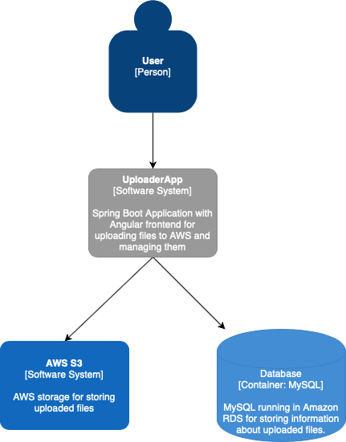

Todo
- tests didn't find the error that delete didn't work
- delete didn;t report any error in the client when it failed
- it is possible to upload file without description
- refresh list when file successfully uploaded
- properly handle errors
- search files
- check na velikost souboru v klientovi
- zobrazit správně “required” do description v klientovi když ho nevyplní
- baseUrl je zkopírované v obou servicach

## Context
Uploader is a web application for management of uploaded images (PNG and JPEG)) running in AWS.
The user can:
- upload files
- list all files
- delete files
- search file by name, descripton and size
  

Maximum size of the uploaded files is 500 KB.
User authentication and authorization is not required.